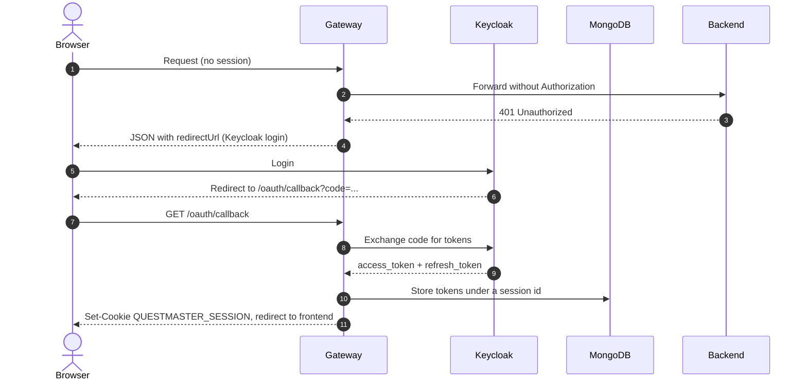

# Authentication

All sites share a single **Keycloak** instance (realm `LiminalLabs`). Browsers never hold tokens: the **gateway** does the OAuth flow, keeps the tokens server side and gives the browser only a session cookie.

## Login flow

## Authenticated requests

On every request the gateway:

1. Reads the session cookie and loads the matching tokens (in-memory cache, falling back to MongoDB).
2. If the access token expired, refreshes it with the refresh token.
3. Injects `Authorization: Bearer <access_token>`, strips the `Cookie` header and forwards the request.

Backends validate the JWT against Keycloak's JWKS endpoint (`OIDC_HOST`, e.g. `http://keycloak:8080/realms/LiminalLabs`).

## Realm

The realm export lives at [`realm/LiminalLabs-realm.json`](https://github.com/hannaBanannaOF/hbsites-architecture/blob/main/realm/LiminalLabs-realm.json).

| Client | Type | Redirect URIs | Used by |
| --- | --- | --- | --- |
| `questmaster` | Confidential | `http://localhost:8081/*` | QuestMaster gateway |

To add a new site, create a confidential client for its gateway and point its redirect URI to the gateway's `/oauth/callback`.

!!! tip "Updating the export"
    After changing the realm in the admin console, export it again (*Realm settings → Action → Partial export*, including clients) and replace the JSON file.
