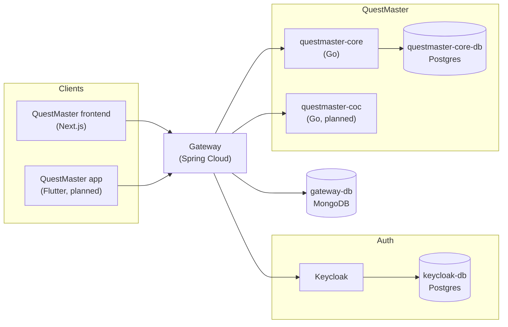

# Liminal Labs Architecture

Architecture and design docs for all my sites: service diagrams, database models, the shared Keycloak realm and the Docker Compose setup used for local development.

!!! note
    *"Liminal Labs"* is just a placeholder name I came up with, it's not a business.

## Overview


- **Gateway** (Spring Cloud Gateway) is the single entry point for every client. It runs the OAuth flow against Keycloak, keeps sessions in MongoDB and turns the session cookie into a Bearer token before forwarding requests. See [Authentication](auth.md).
- **Keycloak** is the shared authentication server for all sites (realm `LiminalLabs`).
- **Backends** validate the token against Keycloak's OIDC endpoint and each one owns its own database.



## Sites

| Site | Description | Docs |
| --- | --- | --- |
| **QuestMaster** | Tabletop RPG campaign and character sheet manager | [Services](questmaster/index.md) · [Database](questmaster/database.md) |
| **SousChef** | Recipes site | [Database](souschef/database.md) |

## Related repositories

| Repository | What it is |
| --- | --- |
| [`gateway`](https://github.com/hannaBanannaOF/gateway) | Spring Cloud Gateway with session-based OAuth |
| [`questmaster-core`](https://github.com/hannaBanannaOF/questmaster-core) | QuestMaster core API (Go + Gin) |
| [`questmaster-frontend`](https://github.com/hannaBanannaOF/questmaster-frontend) | QuestMaster web frontend (Next.js) |

## Editing the diagrams

The diagrams live in [`docs/diagrams/`](https://github.com/hannaBanannaOF/hbsites-architecture/tree/main/docs/diagrams) as `.drawio` files and are rendered directly on these pages, so there is nothing to export. Open them with [draw.io](https://app.diagrams.net/) or the VS Code *Draw.io Integration* extension, save, and the site picks up the changes on the next build.

To embed a specific page (tab) of a diagram, use the page name as the image alt text:

```markdown

```
